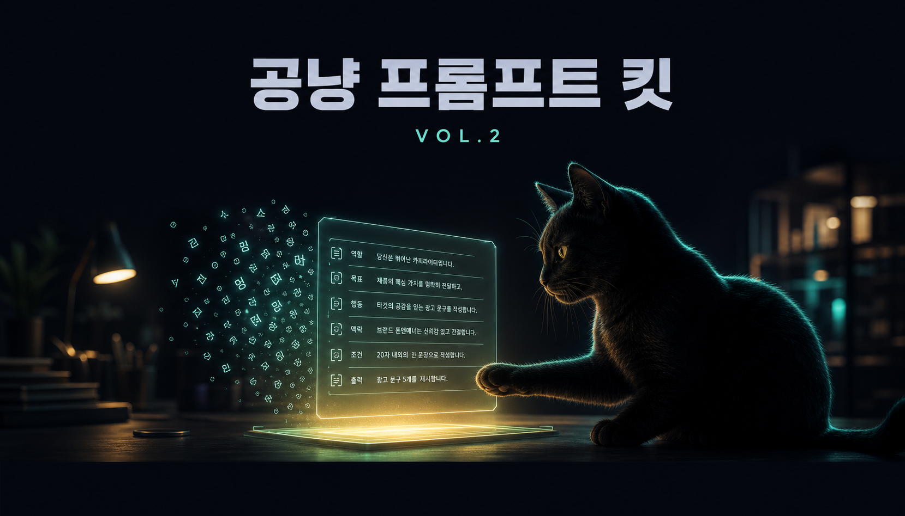
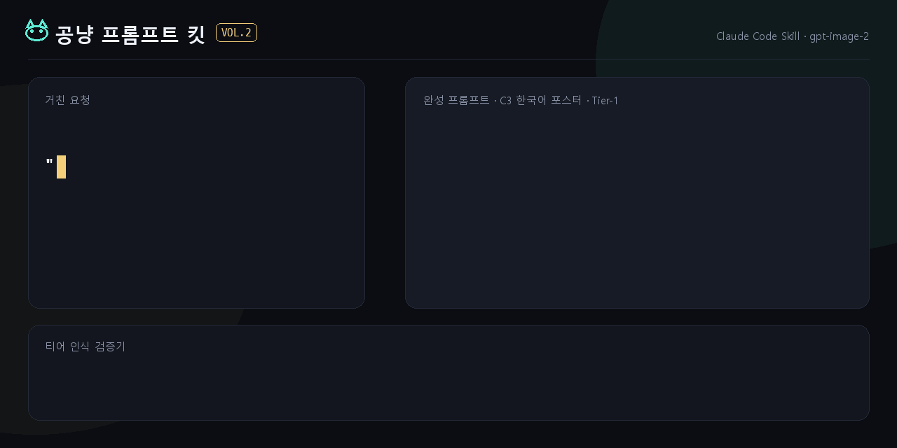
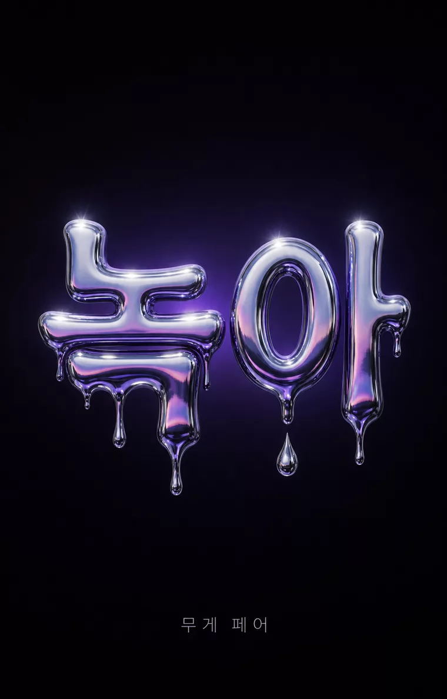
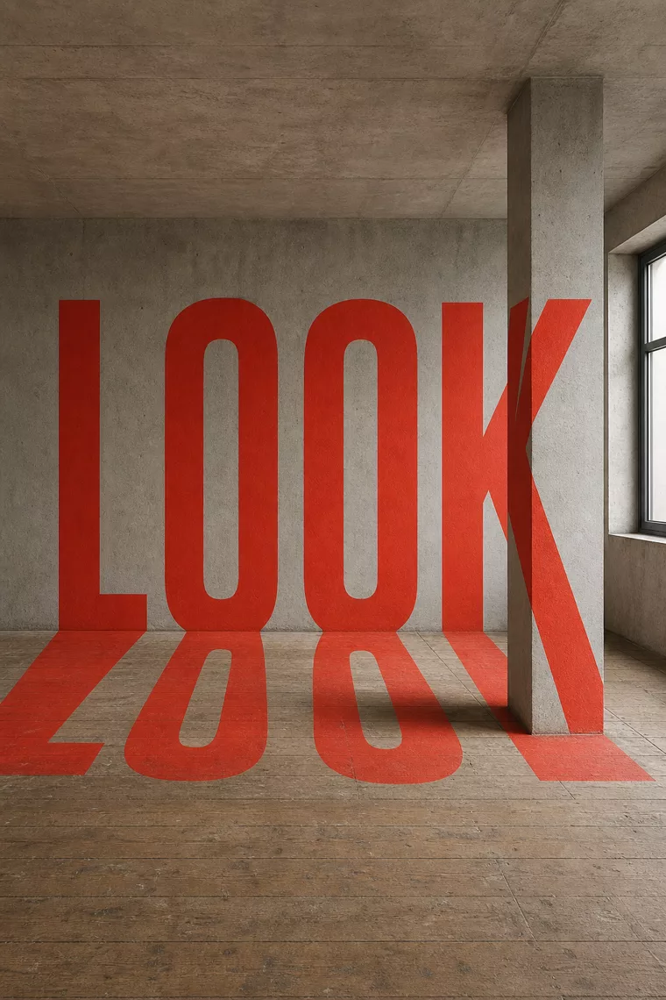

<div align="center">



# 🐾 ゴンニャン・プロンプトキット VOL.2

**漠然としたひと言を gpt-image-2 の完成プロンプトへコンパイルする Claude Code スキル。**

[](LICENSE) &nbsp; &nbsp; &nbsp;

[デモサイト](https://kimsh-1.github.io/gongnyang-prompt-kit) · [インストール](#quickstart) · [ルーティング](#ルーティング) · [한국어](README.md) · [English](README.en.md)

</div>

<p align="center">
  
</p>

<p align="center"><sub>ラフなリクエスト → 完成プロンプト → 検証器パス — この3ステップがスキルの中で完結する。上のキービジュアルも、このキットでコンパイルしたプロンプト（C11 シネマティック・キーアート）から生成した。</sub></p>

## なぜ必要か

- **ナイーブなプロンプトは負ける** — 「ポスターを1枚作って」程度のひと言をそのまま投入すると、モデルはその漠然さをそのまま結果として返してくる。
- **コンパイラ・アプローチ** — リクエストのシグナルをルーティング表の1行にマッピングし、そのパターン1つで、そのまま生成に投入できる完成韓国語プロダクションプロンプトを組み立てる。キットが教える文法（Scene / Camera / Lighting / Color grading / Texture、HEX 固定パレット、末尾の `AR` トークン1つ）は言語非依存で、日本語・英語プロンプトにもそのまま持ち込める。
- **検証器ゲート** — ホワイトリスト外のネガティブ・SD 廃止語彙・サイズロック違反は、生成へ進む前に `error` として捕まる。
- **生成はスコープ外** — 大量生成は [codex-fleet](https://github.com/kimsh-1/codex-fleet) の `codex-imagegen` スキル、1枚だけなら `codex` に直接投入する。

## 違いはプロンプトだけ

同じ gpt-image-2 だ — **左は人間が打ったひと言（「ヤバい画像を1枚作って」）をそのまま入れた結果、右はそのひと言をキットがコンパイルして入れた結果。**

| スキルなし | キットコンパイル — C11 シネマティック・キーアート |
|---|---|
|  |  |

<details>
<summary>コンパイル済みプロンプト全文（韓国語コンパイル記録 — 夜明けの雲海を跳躍する巨大クジラ）</summary>

```
시네마틱 키아트 — 새벽 구름바다 위로 도약하는 거대 고래.
Scene: 해 뜨기 직전의 구름 바다, 그 위로 거대한 혹등고래 한 마리가 구름 물보라를 흩뿌리며 도약하는 순간, 아래 절벽 끝에 작은 관측자 실루엣 한 명, 상단 하늘 밴드는 비워둔 클린 영역.
Camera: 초광각 vista, 로우 앵글, 인물 대비 압도적 스케일 대비, deep aerial perspective.
Lighting: 지평선의 골드 백라이트가 고래의 림을 태우고, 구름 틈으로 volumetric 광선이 쏟아진다.
Color grading: 새벽 인디고 #1B2440, 골드 #E8B168, 페일 로즈 #E8C4C4.
Texture/Medium: cinematic grain, 옅은 안개 드리프트.
AR 16:9
```

</details>

コンパイルレコード全文は [`examples/showcase.jsonl`](examples/showcase.jsonl)。

## Quickstart

```bash
git clone https://github.com/kimsh-1/gongnyang-prompt-kit
ln -s "$PWD/gongnyang-prompt-kit/skills/image-prompt" ~/.claude/skills/image-prompt
```

Claude Code で「画像プロンプトを書いて」「グラビアプロンプト」「キーアート」「タイポポスター」のようなトリガー、または `/image-prompt` で実行する。

```bash
node skills/image-prompt/scripts/check_prompt.mjs examples/poster.txt   # 書いたプロンプトを検査
```

`{ok, format, tier, errors, warnings}` の JSON を返す。パス・失敗サンプルは [`examples/`](examples/) にある。

> [!NOTE]
> シンボリックリンクでインストールすればリポジトリの更新が自動反映される。検証器の実行には Node.js、生成までつなぐには [Codex CLI](https://github.com/openai/codex) のログイン + ChatGPT Plus/Pro が必要だ。

<details>
<summary>検証器オプション全体</summary>

検証器はティアを認識し、ホワイトリスト外のネガティブだけを捕まえる。

```bash
node skills/image-prompt/scripts/check_prompt.mjs examples/poster.txt        # テキストモード
node skills/image-prompt/scripts/check_prompt.mjs --tier 2 examples/hwabo_formatB.txt
node skills/image-prompt/scripts/check_prompt.mjs --jsonl examples/prompts.sample.jsonl
node skills/image-prompt/scripts/check_prompt.mjs --test                     # 回帰セルフテスト
```

ホワイトリスト外のネガティブ・先頭ブラケット・SD 廃止語彙・サイズロック違反・スロットトークン残存は `error`（肯定形 rewrite ヒント付き）、空虚な形容詞・HEX 欠落などは `warning`。

</details>

## ルーティング

v3 のコアはルーティング表ひとつだ — リクエストのシグナルで1行を選び、その行が指すリファレンスファイルを**1つだけ**読む。ルーティングの正本は [`skills/image-prompt/SKILL.md`](skills/image-prompt/SKILL.md) にある表の一箇所のみで、以下はその読者向けミラーだ。

| こう頼むと | こうコンパイルされる | 読むリファレンス |
|---|---|---|
| 単独人物のグラビア・エディトリアル | C1 · Format B フラットカンマ形式 | [`editorial-hwabo.md`](skills/image-prompt/references/editorial-hwabo.md) |
| タイポポスター・「文字がそのまま絵になる」 | TP1〜TP14 からパターン1つ | [`typo-poster-router.md`](skills/image-prompt/references/typo-poster-router.md) → `typo-poster/` 1ファイル |
| 販促グラフィック・「デザインの効いたポスター」 | P1〜P8 からパターン1つ | [`promo-router.md`](skills/image-prompt/references/promo-router.md) → `promo/` 1ファイル |
| ポスター・キーアート・インフォグラフィック・カードニュース・漫画・図鑑・アイコン・ビューティー・キャンペーン・モックアップ | C2〜C11 | [`category-patterns.md`](skills/image-prompt/references/category-patterns.md) 該当セクション |
| プレゼンテーション・スライドデッキ | C12（16:9 デフォルト） | [`category-patterns.md`](skills/image-prompt/references/category-patterns.md) §C12 |
| ムード（「高見えに」・「ラグジュアリーに」・「映画みたいに」） | ルックプリセット L1〜L9 ドロップイン | [`look-presets.md`](skills/image-prompt/references/look-presets.md) |
| 案出しの多様化・「コンセプトから固めて」 | コンセプト軸 M1〜M10 / R / X / T1〜T5 バリエーション | [`concept-axes.md`](skills/image-prompt/references/concept-axes.md) |
| 文字配置・フォント・グリッド・高密度テキスト | 領域文法・ロールラベル | [`typography-layout.md`](skills/image-prompt/references/typography-layout.md) |
| カメラ・照明・色の語彙 | 結果記述の語彙 | [`photo-vocab.md`](skills/image-prompt/references/photo-vocab.md) |
| jsonl バッチ・モデルファクト・完成例 | jsonl スキーマ・codex スケルトン | [`jsonl-and-examples.md`](skills/image-prompt/references/jsonl-and-examples.md) |

ライブラリのカバー範囲: カテゴリ **C1〜C12** · タイポポスター **TP1〜TP14** · 販促グラフィック **P1〜P8** · ルックプリセット **L1〜L9** · コンセプト軸 **M1〜M10 / R / X / T1〜T5**。

## コアルール

うまく出すためのルールではなく、出なくさせる習慣を止めるルールだ — 全文は [`skills/image-prompt/SKILL.md`](skills/image-prompt/SKILL.md) §鉄則。

| ルール | 要旨 |
|---|---|
| **ティアード・ネガティブ** | gpt-image-2 はシーンのネガティブ（"no crowd"）を、むしろその単語のままレンダリングしてしまう。シーンの排除はすべて肯定形の再記述（Tier-0）が基本。例外は2レーンだけ — Tier-1 テキストレンダーガード（ホワイトリスト7種、レンダーテキストがあるときのみ）、Tier-2 グラビア・コンプライアンスペア（明示宣言時のみ、正本は `editorial-hwabo.md` §3 の一箇所）。ホワイトリスト外の否定文は検証器がすべて捕まえる。 |
| **SD 廃止語彙の禁止** | `masterpiece / 8k / trending on artstation`、重み付け `(word:1.3)`、`--ar` フラグも、「きれいに・高級感を・アワード級に」のような空虚な形容詞もノイズだ。数値・身体反応・具体例に還元する。 |
| **サイズロック** | codex（`$imagegen`）経路で安全なのは6種のみ — 1:1 `1024x1024` · 2:3/3:4/4:5 `1024x1536` · 3:2/4:3 `1536x1024` · 16:9 `1792x1024` · 9:16 `1024x1792` · 高密度/マルチカット `2048x2048`。`auto` 禁止、プロンプト先頭の `[AR ...]` ブラケット禁止、末尾に `AR x:y` トークン1つだけ。 |
| **文字の後処理は絶対禁止** | テキストはプロンプトで画像の中にレンダリングする（引用符コピー + ロールラベル + 自由記述ゾーン）。生成済み PNG の上にコードで文字を合成（PIL・ImageMagick・SVG）すると、フォント・カーニング・トーンが浮く。文字の誤りはプロンプト修正後の再生成でのみ直す。 |
| **機材スペック → 結果記述** | モデルは `Canon R5 f/1.4` を知らない。"shallow DoF, background falls off softly" のように結果で書く。 |
| **数値を打ち込む** | HEX パレット（カットあたり3〜5色）、ケルビン、`key:fill 1:2`。 |
| **1行 = 1カット = 1コール** | 1つのキャンバスに複数カットをグリッドで描かない。複数カットは N 行に分ける。 |

## ベストカット

| TP8 · リキッドクローム（녹아） | TP13 · アナモルフィック錯視（LOOK） | TP14 · ミクログラフィー（고요） |
|---|---|---|
|  |  |  |
| **オクルージョン × 影の叙事（家）** | **マスキング × タイポ環境（嵐）** | **L9 影の叙事（フィルムカメラ）** |
|  |  |  |

ギャラリー全体（ビフォー/アフター比較 21ペア・TP 14種・P 12カット・L9 12カット）→ [デモサイト](https://kimsh-1.github.io/gongnyang-prompt-kit) · 高密度図表の代表カットは [`examples/diagram-gallery/`](examples/diagram-gallery/)

## 構造・リリース・ライセンス

SKILL.md には常時ロードされるコアだけを置き、深いディテールは `references/` に分離した（progressive disclosure）。

<details>
<summary><code>skills/image-prompt/</code> ツリー全体</summary>

```
skills/image-prompt/
├─ SKILL.md                      # コア — ワークフロー・単一ルーティング表・鉄則・フォーマット A/B・サイズロック・検証器
├─ references/                   # ルーティング表が指すときだけ読む深い内容
│  ├─ category-patterns.md       #   C1〜C12 カットタイプ・デフォルト AR・漫画・キーアート・デッキ
│  ├─ look-presets.md            #   ルックプリセット L1〜L9 ドロップイン
│  ├─ promo-router.md            #   販促グラフィックルーター（P1〜P8）・仕上げデバイス・クロスブリード
│  ├─ promo/                     #     P1〜P8 パターン別ドロップイン（ルーターが選んだ1つだけロード）
│  ├─ typo-poster-router.md      #   タイポポスタールーター（TP1〜TP14）
│  ├─ typo-poster/               #     TP1〜TP14 パターン別ドロップイン（ルーターが選んだ1つだけロード）
│  ├─ concept-axes.md            #   コンセプト軸 — 潮流 M1〜M10・身体反応の翻訳・矛盾ペア・カラー翻訳・タイポアート T1〜T5
│  ├─ typography-layout.md       #   領域文法・ロールラベル・フォント語彙・グリッド
│  ├─ editorial-hwabo.md         #   グラビア Format B・スロット12種・Tier-2 正本（§3）
│  ├─ jsonl-and-examples.md      #   jsonl スキーマ・モデルファクト・codex 呼び出しスケルトン
│  ├─ photo-vocab.md             #   カメラ・照明・フィルム・構図・色の語彙 + 韓/英混用
│  └─ style-taxonomy.md          #   ファッション21種 + persona DNA
└─ scripts/
   ├─ check_prompt.mjs           # ティア認識検証器（--jsonl/--tier/--api/--test）
   └─ fixtures/                  # 回帰テストフィクスチャ
```

</details>

変更履歴・検証実測 → [GitHub Releases](https://github.com/kimsh-1/gongnyang-prompt-kit/releases) · リリースチェックリスト [`RELEASING.md`](RELEASING.md) · ライセンス [MIT](LICENSE)

---

<div align="center">
<sub>🐾 漠然としたひと言 → 完成プロンプト — <a href="https://kimsh-1.github.io/gongnyang-prompt-kit">kimsh-1.github.io/gongnyang-prompt-kit</a></sub>
</div>
