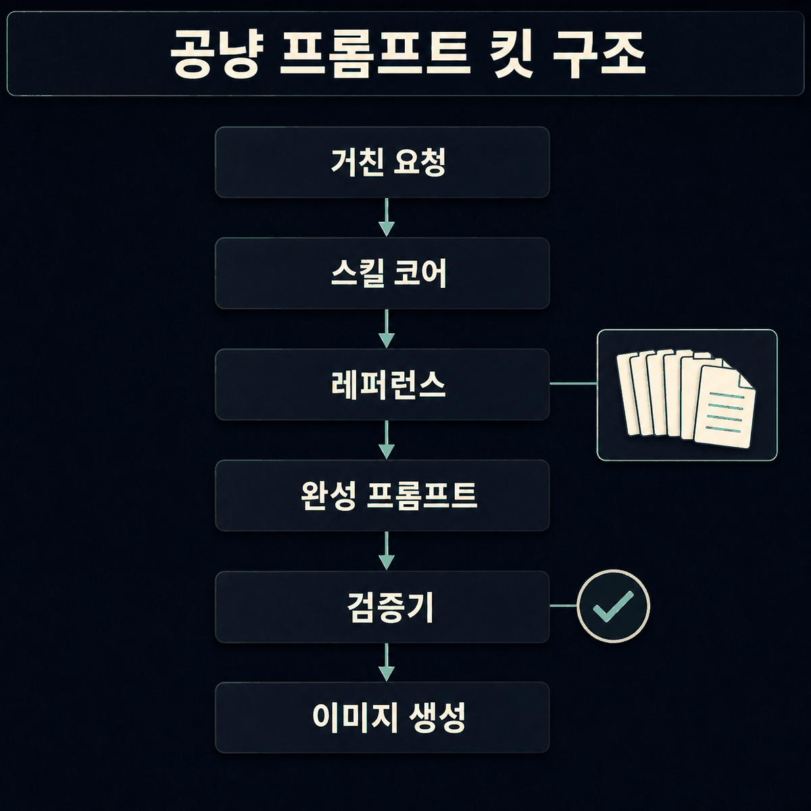

# 🐾 공냥 프롬프트 킷 VOL.2

**막연한 한마디를 gpt-image-2 완성 프롬프트로 컴파일하는 Claude Code 스킬.**


"포스터 하나 만들어줘" 같은 거친 한마디를 바로 생성에 넣을 수 있는 완성 한국어 프로덕션 프롬프트로 바꾼다. 1,000장 규모로 라이브러리·화보·포스터·만화를 뽑는 내내 다듬은 규칙을 한 스킬에 다 묶었다. 위 키비주얼도 이 킷으로 컴파일한 프롬프트(C11 시네마틱 키아트)로 뽑은 것.

> 인터랙티브 데모: **[kimsh-1.github.io/gongnyang-prompt-kit](https://kimsh-1.github.io/gongnyang-prompt-kit)**

---

## 핵심 규칙

이미지를 잘 나오게 만드는 규칙이 아니다. **안 나오게 하는 습관을 막는** 규칙이다.

- **네거티브 기본 금지 + 화이트리스트 2종.** gpt-image-2는 장면 네거티브("no crowd")를 오히려 그 단어로 렌더한다 — 장면 요소 배제는 전부 긍정형("프레임 안엔 인물 한 명, 단독"). 예외는 딱 두 레인: **텍스트 렌더 가드**(`no duplicate text, no invented glyphs` 등 — OpenAI 공식 가이드도 쓰는 제약형 문구)와 **에디토리얼 화보 안전 블록**(성인·비노출·불투명을 명시하는 고정 문구 — 정책 적합성을 프롬프트에 서명하는 컴플라이언스 스티어링). 그 밖의 부정문은 여전히 전부 금지다. 검증기가 잡는다.
- **앞머리 `[AR x:y SIZE]` 브래킷 안 씀.** size는 API 파라미터다. 프롬프트엔 끝에 `AR x:y` 토큰만.
- **글자 배치는 영역 문법으로.** "상단 1/3 타이틀 밴드", 3×3 영역 명명, 롤 라벨(headline/subhead/callout), 따옴표 카피 고정 + verbatim. 밀집 텍스트는 quality high와 페어링.
- **장비 스펙은 결과로 환원.** 모델은 `Canon R5 f/1.4`를 모른다. "shallow DoF, background falls off softly"로 쓴다.
- **SD 품질태그 버린다.** `masterpiece, 8k, ultra-detailed`는 노이즈.
- **수치는 박는다.** HEX 팔레트, 켈빈, `key:fill 1:2`.
- **1행 = 1컷 = 1 호출.** 한 캔버스에 그리드로 여러 컷 그리지 않는다. (카드뉴스 내부 그리드처럼 그리드 자체가 산출물인 경우만 예외.)

## 컴파일 데모


## 두 가지 포맷

- **Format A — 라벨 6섹션.** Scene/Camera/Lighting/Color grading/Texture/Text-in-image. 포스터·키아트·인포그래픽·도감 등 구조물.
- **Format B — 화보 플랫 콤마형.** 피사체→얼굴→헤어→장르앵커→장면/포즈→의상→구도→조명→팔레트 #HEX→질감→AR 한 문장. 단독 인물 화보/에디토리얼 전용, 배치 변주에 최적.

## 구성



(이 구조도 역시 이 킷으로 컴파일한 C6 인포그래픽 프롬프트를 codex에 넣어 뽑았다.)

```
skills/image-prompt/
├─ SKILL.md                      # 코어 — 워크플로우·철칙·티어 네거티브·포맷 A/B·사이즈락·라우팅
├─ references/                   # 필요할 때만 읽는 깊은 내용
│  ├─ category-patterns.md       #   C1~C11 컷타입·기본 AR·만화 A/B 전략·키아트
│  ├─ typography-layout.md       #   영역 문법·롤 라벨·폰트 어휘·정확 문자열·그리드
│  ├─ editorial-hwabo.md         #   화보 Format B·슬롯 12종·컴플라이언스 레인
│  ├─ jsonl-and-examples.md      #   jsonl 스키마·모델 팩트·codex 호출 골격
│  ├─ photo-vocab.md             #   카메라·조명·필름·구도·색 어휘 + 국문/영문 혼용
│  └─ style-taxonomy.md          #   패션 21종 + persona DNA + 마스터 템플릿
└─ scripts/
   ├─ check_prompt.mjs           # 티어 인식 검증기 (--jsonl/--tier/--api/--test)
   └─ fixtures/                  # 회귀 테스트 픽스처
```

SKILL.md엔 항상 로드되는 코어만 가볍게 두고, 깊은 디테일은 `references/`로 뺐다(progressive disclosure).

## 설치

Claude Code 개인 스킬로:

```bash
ln -s "$PWD/skills/image-prompt" ~/.claude/skills/image-prompt
```

(복사로 깔아도 되긴 된다. 다만 심볼릭 링크는 레포 업데이트를 알아서 물어온다. 복사로 깔았다면 업데이트 때마다 다시 복사할 것.)

이후 "이미지 프롬프트 써줘", "화보 프롬프트", "키아트", "글자 배치" 같은 트리거나 `/image-prompt`로 작동한다.

## 검증기

써놓은 프롬프트가 규칙을 지켰는지 자동으로 검사한다.

```bash
node skills/image-prompt/scripts/check_prompt.mjs examples/poster.txt      # 텍스트 모드
node skills/image-prompt/scripts/check_prompt.mjs --tier 2 examples/hwabo_formatB.txt
node skills/image-prompt/scripts/check_prompt.mjs --jsonl examples/prompts.sample.jsonl
node skills/image-prompt/scripts/check_prompt.mjs --test                   # 회귀 셀프테스트
```

`{ok, format, tier, errors, warnings}` JSON을 반환한다. 화이트리스트 밖 네거티브·앞 브래킷·SD 폐기어휘·사이즈락 위반·ar↔size 불일치·슬롯 토큰 잔존을 `error`(긍정형 rewrite 힌트 포함)로, 빈 형용사·HEX 누락 등을 `warning`으로 잡는다. 통과·실패 샘플은 `examples/`에 다 들어있다.

## 카테고리 (C1~C11)

패션/화보 · 뷰티 · 한국어 포스터 · 제품 도감 · 캠페인 · 인포그래픽 · 카드뉴스 · 브랜딩 목업 · 3D 아이콘 · 만화/웹툰 · **시네마틱 키아트**. 각 컷타입·기본 AR은 `references/category-patterns.md`.

## 생성

이 스킬은 **프롬프트를 쓰는 것**까지만 한다. 실제 대량 생성·병렬 스폰은 별도 — [codex-fleet](https://github.com/kimsh-1/codex-fleet)의 `codex-imagegen` 스킬을 쓴다. 단일 1장은 그냥 `codex`에 넣으면 된다.

## 요구사항

- Node.js (검증기 실행용)
- 생성까지 하려면 [Codex CLI](https://github.com/openai/codex) 로그인 + ChatGPT Plus/Pro

## 라이선스

MIT

